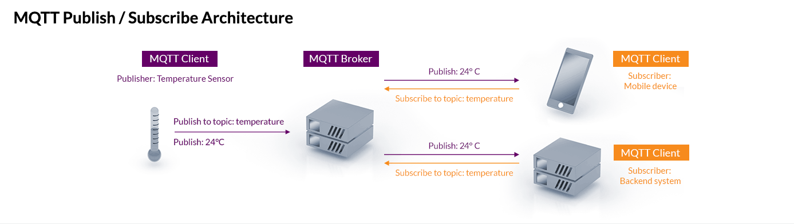

# What is  MQTT
##  簡介
MQTT 協定於 1999 年編製，用於石油與天然氣產業。工程師需要一種協定來實作最小頻寬和最小電池損耗，以透過衛星監控石油管道。

最初，*`由於 IBM 產品 MQ 系列首先支援其初始階段，因此該協定被稱為訊息佇列遙測傳輸 ( Message Queuing Telemetry Transport )`*。
2010 年，IBM 發佈了 MQTT 3.1 作為任何人都能實作的免費開放協定，然後於 2013 年提交給結構化資訊標準促進組織 (OASIS) 規範機構進行維護。2019 年，OASIS 發佈了升級的 MQTT 版本 5。現在，MQTT 不再是首字母縮略詞，而被認為是協定的正式名稱。 

其 設計的目的，是讓設備能夠透過網路傳送小型數據包，控制訊息最小只有 2 位元組的資料，將訊息用最精簡的方式傳送出去，並且使用較少的網路頻寬和電力。由於 MQTT 具備可靠性高、可擴展性強、網路傳輸效率高⋯⋯等特點，故廣泛應用於各種場景中，例如物聯網、Facebook Messenger 即時通訊、遠程控制等。

## 基本原理

MQTT 協定定義了兩種網路實體：訊息代理（message broker）與客戶端（client）。
* 訊息代理( message broker ) 用於接收來自客戶端的訊息並轉發至目標客戶端。
* 客戶端( client )可以是任何執行有 MQTT 庫並通過網路連接至訊息代理的裝置，例如微型控制器或大型伺服器。

資訊的傳輸是通過主題（topic）管理的。發布者( publisher )有需要分發的資料時，其向連接的訊息代理( message broker)發送攜帶有資料的控制訊息。
代理( message broker )會向訂閱此主題的客戶端( subscriber )分發此資料。發布者不需要知道訂閱者的資料和具體位置；同樣，訂閱者不需要組態發布者的相關資訊。

如果訊息代理接受到某個主題上的訊息，且這個主題沒有任何訂閱，那麼代理就會丟棄之，除非發布者將其標記為保留訊息（retained message）。

當發布客戶端首次與代理連接時，客戶端可以設定一個預設訊息。當代理發現發布者意外斷開，其會向訂閱者傳送此預設的訊息。

客戶端僅與代理有直接的資料傳輸，但整個系統中可能有多個代理，其於當前訂閱者的主題交換資料。

另外 MQTT 定義了三種不同的 QoS 等級：QoS 0、QoS 1 和 QoS 2。

* QoS 0 為最多傳輸一次，且不保證訊息能夠成功傳出；
* QoS 1 為至少傳輸一次( 握手2次 )，可以確保消息能夠到達接收端，但可能會重複傳輸；
* QoS 2 為確實傳輸一次( 握手4次 )，傳送訊息時會分成兩段式，並保證消息能夠到達接收端，但也可能導致較高的延遲。
## MQTT vs HTTP 差異

MQTT was designed for the Internet of Things (although it wasn’t called that at the time) whereas HTTP was created to make documents available across the internet.

 They both run over TCP connections, and are both client-server in architecture, but MQTT allows messages to pass in both directions  between clients and servers whereas  HTTP servers only respond to requests from clients. 

MQTT 與 HTTP 都是利用 TCP / IP 協定來傳遞資料，只是 MQTT 是雙向溝通，而 HTTP 則是單向回應 Responses ( Once an MQTT connection is established, any number of messages can be sent through it in both directions, data from sensor to back-end, and commands the other way )

HTTP deals with requests one at a time, with overhead such as authentication being carried out each time. HTTP does have some ability to pool TCP connections, but the overhead for each message remains. MQTT message payloads are binary, whereas HTTP are textual so that binary data needs to be base64 encoded.

## MQTT 和 HTTP 的通信模式對於數據隱私和安全有何不同影響？

首先，MQTT 通常使用 TLS（ Transport Layer Security ）或其前身 SSL（ Secure Sockets Layer ）來加密通信，這有助於確保數據的機密性和完整性。通過加密，MQTT可以防止未經授權的截取和竊聽，從而保護敏感的IoT信息。此外，MQTT還支持基於X.509證書的身份驗證，這進一步增強了通信的安全性。

相比之下，HTTP的通信模式在安全性方面較為薄弱。雖然HTTP也可以使用 TLS / SSL 來加密通信，但它的請求-響應模式和文本型消息傳輸使得數據的安全性相對較低。特別是在物聯網環境中，HTTP的請求-響應模式可能會導致數據的安全性和隱私性受到威脅，因為每次請求都需要進行身份驗證，這可能會增加風險。

總的來說，MQTT的通信模式對於數據的隱私和安全性有著更好的保護，特別是在IoT環境中。它的加密和身份驗證功能使得數據在傳輸過程中更難受到未經授權的訪問和竊取。
因此，在考慮數據隱私和安全性時，選擇通信協議時應該考慮到這些因素。

## 後記

在查詢資料的途中，發現 FaceBook Messenger 和 Instagram 都是使用 MQTT over Socket 的技術，主要因為行動物聯網必須去考量到頻寬與電池的使用，而非我們一般的認知單純使用 Websocket 與 Restful API 。
:::info
When we joined Facebook and started to build Messenger, our first technical challenge was learning the entire infrastructure stack for Facebook Messages. It was great to be building on a scalable platform that had already launched to hundreds of millions of users, but the system contained certain assumptions and design decisions that didn’t always quite mesh with the product we wanted to build. Luckily, our new colleagues were also excited about the vision for Messenger and joined the effort to make sure the system could do what we needed.

One of the problems we experienced was long latency when sending a message. The method we were using to send was reliable but slow, and there were limitations on how much we could improve it. With just a few weeks until launch, we ended up building a new mechanism that maintains a persistent connection to our servers. To do this without killing battery life, we used a protocol called MQTT that we had experimented with in Beluga. MQTT is specifically designed for applications like sending telemetry data to and from space probes, so it is designed to use bandwidth and batteries sparingly. By maintaining an MQTT connection and routing messages through our chat pipeline, we were able to often achieve phone-to-phone delivery in the hundreds of milliseconds, rather than multiple seconds.
:::

## 資料來源

* https://mqtt.org/
* https://resource.webduino.io/blog/mqtt-guide
* https://www.hivemq.com/article/mqtt-vs-http-protocols-in-iot-iiot/
* https://engineering.fb.com/2011/08/12/android/building-facebook-messenger/
