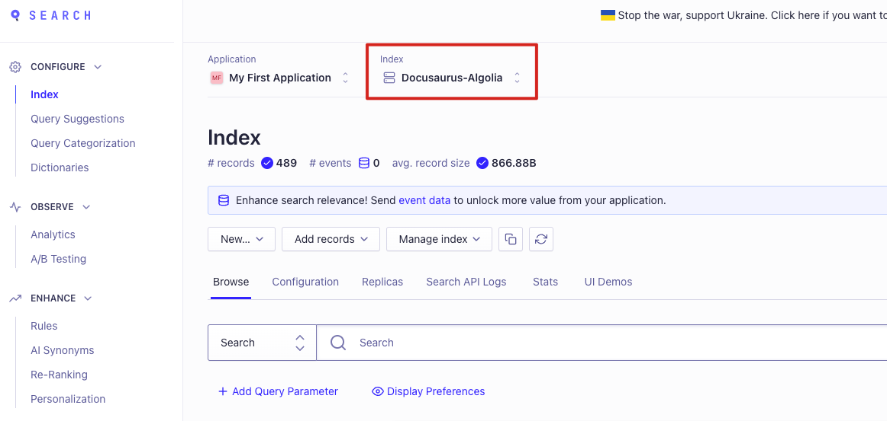
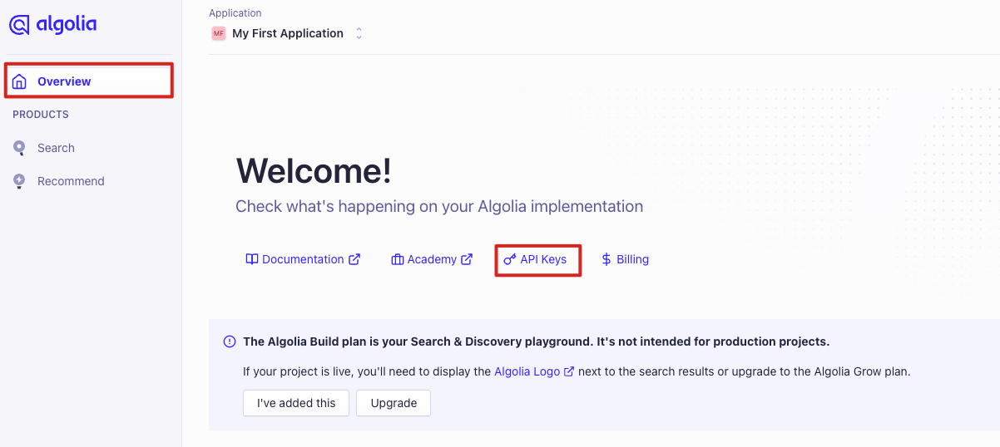
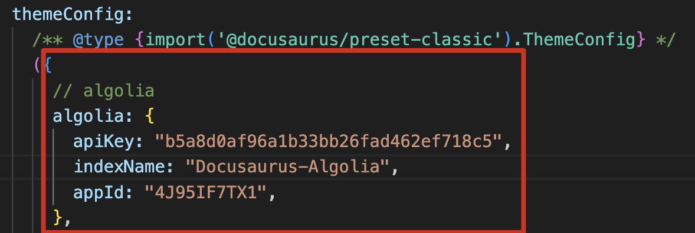
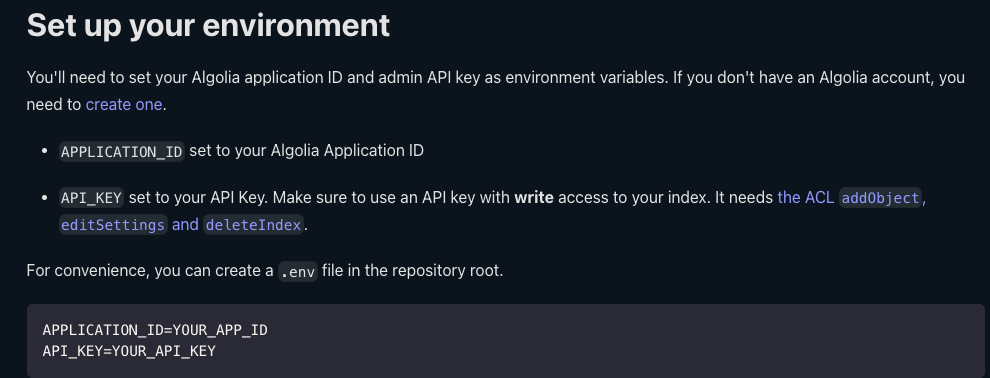
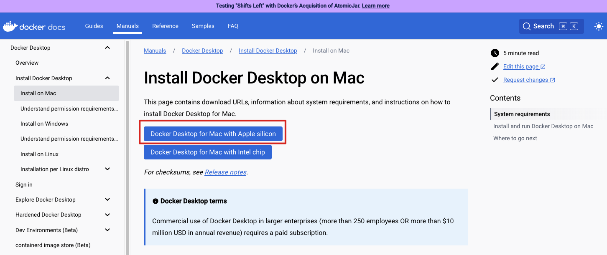
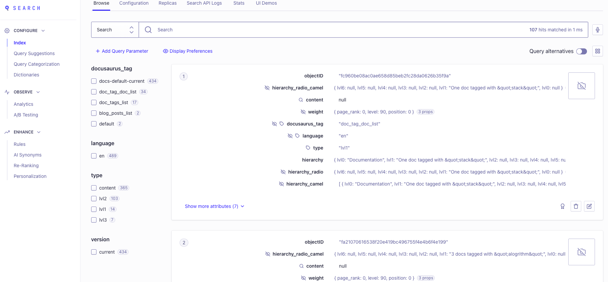

# 設定Algolia 搜尋功能
這篇文章主要是介紹 Docusaurus blog 中如何設定 Algolia，讓使用者可以快速的在 blog 中快速搜尋自己要的文章。

Blog 本身已部署在 Vercel 上，電腦的作業系統是 mac，後續的介紹都是以 mac 系統設定為主。
## 安裝套件
於專案底下安裝 <font color="#EE7700"> docsearch </font>。
```bash title="[Terminal]" showLineNumbers
npm install @docsearch/react
```
## 註冊 Algolia 
先到 Algolia [官方網站](https://dashboard.algolia.com/apps/4J95IF7TX1/explorer/browse/Docusaurus-Algolia?searchMode=search) 進行註冊並登入，推薦使用 github 登陸比較方便。

登陸後一開始會先要你建立基本訊息，註冊成功會直接來到 index 的建立，這邊的<font color="#EE7700"> index </font> 名字蠻重要的，可以先記錄下來。


接著跳轉到首頁 <font color="#EE7700">API Keys </font>的部分，並在 ACL 部分新增下面參數，分別為 `addObject`、`editSettings`、`deleteIndex`，新增完成後就按下 Create。


## docusaurus.config.js 設定
開啟 docusaurus.config.js，在 themeConfig 新增一個 algolia 物件，在該物件中需要帶入三個參數。

*PS : 這邊的參數設定不要抄我的，記得以自己設定為主。*

* apiKey : Algolia 的 API Key。
* indexName : Algolia 的 index 名稱。
* appId : Algolia 的 Application ID。

<!--  -->
## 環境變數與 Docker 設定爬蟲
### .env file setting 
先到  [DOCSEARCH 官網](https://docsearch.algolia.com/docs/legacy/run-your-own) 看要如何新增設定 <font color="#EE7700">.env 檔案 </font> ，並且設定你的 Application ID 和 API key 。

<font color="gree">必須注意的是 .env file 中的 API key 為你的 Admin API key </font>




```bash title="[.env]" showLineNumbers
APPLICATION_ID= input your APP ID
API_KEY= input your Admin API Key
```
###  algoliasearch.exceptions.RequestException: Method not allowed with this API key 的解決方法

當遇到'algoliasearch.exceptions.RequestException: Method not allowed with this API key'的問題時，錯誤並非由Python版本引起。

問題根源在於.env文件中配置的API_KEY不正確，應使用Admin API Key而非Search Only Key。

修正.env文件並使用正確的Admin API Key後，通過Docker鏡像上傳數據即可成功。

### config.json file setting 

之後在根目錄再新增一個 json 檔案，名為 config.json，設定如下。

有三個地方需要做更改，分別是：

* index_name：你的 Algolia index 名稱
* start_urls：你的 Docusaurus 網址
* sitemap_urls：你的 Docusaurus 網址的 sitemap

```bash title="[config.json]" showLineNumbers
{
    "index_name": "Docusaurus-Algolia",
    "start_urls": ["https://xxxxtim-github-io.vercel.app/"],
    "sitemap_urls": [
      "https://xxxxtim-github-io.vercel.app/sitemap.xml"
    ],
    "sitemap_alternate_links": true,
    "stop_urls": ["/tests"],
    "selectors": {
      "lvl0": {
        "selector": "(//ul[contains(@class,'menu__list')]//a[contains(@class, 'menu__link menu__link--sublist menu__link--active')]/text() | //nav[contains(@class, 'navbar')]//a[contains(@class, 'navbar__link--active')]/text())[last()]",
        "type": "xpath",
        "global": true,
        "default_value": "Documentation"
      },
      "lvl1": "header h1",
      "lvl2": "article h2",
      "lvl3": "article h3",
      "lvl4": "article h4",
      "lvl5": "article h5, article td:first-child",
      "lvl6": "article h6",
      "text": "article p, article li, article td:last-child"
    },
    "strip_chars": " .,;:#",
    "custom_settings": {
      "separatorsToIndex": "_",
      "attributesForFaceting": ["language", "version", "type", "docusaurus_tag"],
      "attributesToRetrieve": [
        "hierarchy",
        "content",
        "anchor",
        "url",
        "url_without_anchor",
        "type"
      ]
    },
    "conversation_id": ["833762294"],
    "nb_hits": 46250
  }
```
### Docker 與 jq 的相關安裝
首先到 [Docker 官網](https://docs.docker.com/desktop/install/mac-install/) 進行桌面版的安裝，由於我的電腦是 arm 的版本，因此選擇 apple silicon ，安裝完成後並且運行 Docker 。



接著安裝 jq (a lightweight command-line JSON processor) 
```bash title="[Terminal]" showLineNumbers
$ brew install jq
```
### 爬取資料並新增至 Algolia
輸入以下指令並且進行資料爬取。

<font color="gree"> PS : 由於我的電腦為 Mac Arm64 的規格，所以指令需要指定平台為 linux / amd64 才能執行 </font>

```bash title="[Terminal]" showLineNumbers
docker run -it --platform linux/amd64 --env-file=.env -e "CONFIG=$(cat ./config.json | jq -r tostring)" algolia/docsearch-scraper

```
執行成功的話，會看到 docsearch-scraper 正在爬取我們的網站內容，並將資料新增至 Algolia。


----
## 參考資料：

https://medium.com/@weiyun0912/docusaurus-%E5%9C%A8-docusaurus-%E4%B8%AD%E4%BD%BF%E7%94%A8-algolia-%E5%AF%A6%E4%BD%9C%E6%90%9C%E5%B0%8B%E5%8A%9F%E8%83%BD-4953b6ed4c34

https://docsearch.algolia.com/docs/legacy/run-your-own#integration

https://www.youtube.com/watch?v=lNkVxDSRo7M
