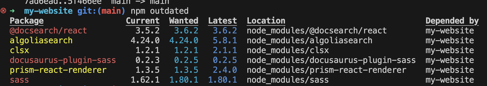
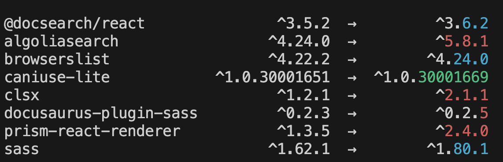

# 更新專案中的 npm 相依套件
在專案中我們常常遇到<font color="red"> 使用的套件是否要更新？？</font>
有時候套件的更新可以使專案提升效能或是解決安全性問題。
## 使用 npm outdated 指令
`npm outdated` 指令用於檢查專案中已安裝的 npm 套件是否有可用的更新。它會列出目前安裝的版本、建議更新的版本以及最新版本。
這個指令可以幫助開發者了解哪些套件需要更新，以便保持專案的最新狀態。
```bash showLineNumbers title="[Terminal]"  
# 顯示專案相關版本號
npm outdated
```
這個指令會顯示一個表格，包含以下欄位：
- **Package**: 套件名稱
- **Current**: 當前安裝的版本  
首先我們可以先確認一下專案底下目前套件的版本以及可使用的版本，再來進行更新。



如圖所示，顯示的版本好三種，Current(目前版本)/Wanted（建議版本） / Latest（最新版） ，根據所需更新要使用的版本號。


最後再使用 `npm outdated` 來確認 package 是否有更新即可，如下圖所示。

## 使用 npm-check-updates [常用]
npm update，只能按照package.json中標注的版本號進行更新，升級後不會修改package.json中的版本號，需要自己手動修改，比較麻煩。
<font color="yellow">npm-check-updates 升級插件升級後會自動修改package.json里的版本號，簡單方便。</font>

```bash showLineNumbers title="[Terminal]"  
# 全域安裝在電腦上
npm install -g npm-check-updates
```
```bash showLineNumbers title="[Terminal]"  
# 執行更新
ncu -u
```
這樣就會更新 package.json 檔案中的版本號，接著再執行 `npm install` 來安裝最新的套件。

```bash showLineNumbers title="[Terminal]"
# 安裝最新的套件
npm install
```
這樣就完成了專案中 npm 相依套件的更新。
## 注意事項
在更新套件之前，建議先備份專案，以免更新後出現不兼容的情況導致專案無法正常運行。
## 其他方法
如果不想使用 `ncu`，也可以手動更新 `package.json` 中的版本號，然後執行 `npm install` 來安裝最新的套件。

```json
{
  "dependencies": {
    "example-package": "^2.0.0"
  }
}
```
然後執行以下命令：

```bash showLineNumbers title="[Terminal]"
npm install
```
這樣也可以達到更新套件的目的。
## 結論
更新 npm 相依套件是保持專案健康和安全的重要步驟。使用 `npm outdated` 和 `ncu` 可以輕鬆地檢查和更新套件版本，確保專案使用最新的功能和修復。
這樣可以提高專案的穩定性和安全性，並且能夠利用最新的功能和性能改進。
## 參考資料
npm 官方文件提供了詳細的指令和使用方法，可以參考以下連結了解更多細節。
```bash showLineNumbers title="[Terminal]"
npm help outdated
npm help update
npm help install
```

         
資料來源
https://docs.npmjs.com/cli/v8/commands/npm-outdated