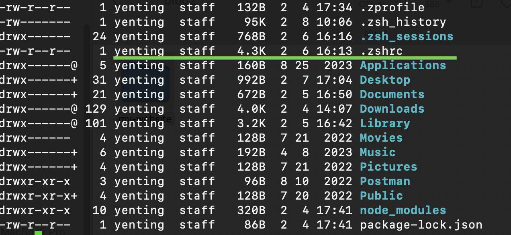
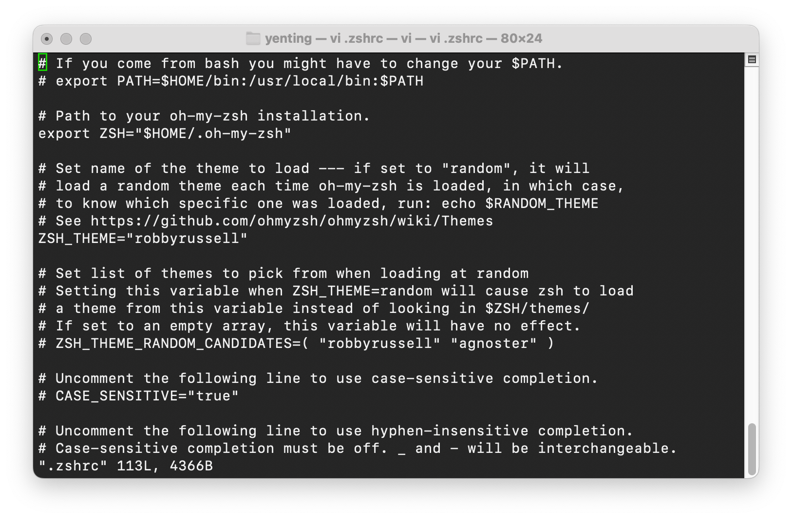

# Python3 install path error and solved method
1. 利用`Homebrew`指令進行python3的安裝
```bash title="[Terminal]" showLineNumbers
# install python3
brew install python3
# show installed package
brew list
# clean cache
brew cleanup
```

 2. 如圖所示，安裝完 Python時跳出的告警如下，這個問題主要是<font color="yellow">Python 與 Python3 的安裝路徑不一致所引起，</font>
```bash title="[Terminal]" showLineNumbers
==> Caveats
Python has been installed as
  /usr/local/bin/python3.11

Unversioned and major-versioned symlinks `python`, `python3`, `python-config`, `python3-config`, `pip`, `pip3`, etc. pointing to
`python3.11`, `python3.11-config`, `pip3.11` etc., respectively, have been installed into
  /usr/local/opt/python@3.11/libexec/bin
```
3. 解決方法如下

- 確認Python 與 Python3 的路徑，可以使用 `where`這個指令去查詢
```bash title="[Terminal]" showLineNumbers
where python3
where python
```
- 如果路徑不一致，則進行`./zshre`修改
`./zshrc`檔案主要在電腦user底下，可以利用`ll -al`進行查詢

- 利用`vi`開啟 `./zshrc`並進行修正
```bash title="[Terminal]" showLineNumbers
# open .zshrc file
vi .zshrc
```

這邊以 <font color="yellow">python3 的安裝路徑為主要路徑，並將python 的路徑指向python3 </font>，於 `./zshrc`文件下面貼上下面指令並存檔即可。
```bash title="[Terminal]"showLineNumbers
# ensure "python3" command uses homebrew's version of python3
alias python3=/opt/homebrew/bin/python3
# OPTIONAL: ensure "python" command uses homebrew's version of python3
alias python=/opt/homebrew/bin/python3
```
參考資料如下 ：
https://apple.stackexchange.com/questions/450303/how-to-make-python-3-11-my-default-python3-with-brew


