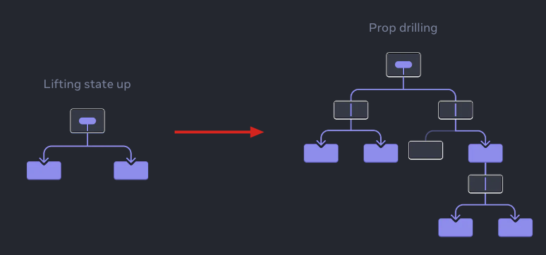
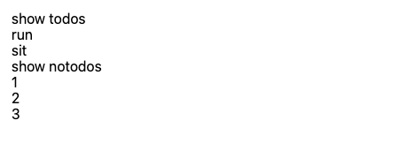

# [ react ]  Context API 的使用 
##   Context api 的使用情境
一般來說，如果想要在 react 中使用<font color="#FFBB00"> 全域變數</font>，並且希望每個 Component 都可以使用到，而且不想用到 Props 的話，就可以使用此種方法。
( Context is primarily used when some data needs to be accessible by many components at different nesting levels. Apply it sparingly because it makes component reuse more difficult.)




主要使用到的語法如下：
* createContext
* provider
* useContext
## Step 1: Create the context
:::tip Create the context
The only argument to createContext is the default value. <font color="red">but you could pass any kind of value (even an object). </font>

You will see the significance of the default value in the next step.
:::

* defaultValue: The value that you want the context to have when there is no matching context provider in the tree above the component that reads context. If you don’t have any meaningful default value, specify null. The default value is meant as a “last resort” fallback. It is static and never changes over time.
* <font color="#FFBB00">createContext returns a  context object.</font>
```js  showLineNumbers
import React from 'react';
import './style.css';
// use createContext
// highlight-next-line
const ContextStore = React.createContext({
  todos: [],
});

```
## Step 2: Provide the context 

```js  showLineNumbers

// 使用 ContextStore
// 並將要使用到 ContextStore 的 Component 包裹其中 
function Application() {
  return (
    // highlight-next-line
    <ContextStore.Provider
      value={
        { 
          todos: ['run', 'sit'], 
          notodos: ['1', '2', '3'] 
          }
          }
    >
      <Todos />
      // highlight-next-line
    </ContextStore.Provider>
  );
}
```
## Step 3 : Use the context 
:::tip useContext

useContext is a Hook. Just like useState and useReducer, you can only call a Hook immediately inside a React component (not inside loops or conditions). useContext tells React that the Heading component wants to read the LevelContext.

:::
```js  showLineNumbers
// Todos
function Todos() {
  // highlight-next-line
  const value = React.useContext(ContextStore);

  return (
    <React.Fragment>
      <div>show todos</div>
      {value.todos.map((todo) => (
        <div key={todo}>{todo}</div>
      ))}

      <div>show notodos</div>
      {value.notodos.map((notodos) => (
        <div key={notodos}>{notodos}</div>
      ))}
    </React.Fragment>
  );
}

export default function App() {
  return (
    <div>
      <Application />
    </div>
  );
}
```

結果如下：




## 資料來源
* https://whien.medium.com/%E9%80%8F%E9%81%8E-react-usecontext-%E8%88%87-usereducer-%E4%BE%86%E5%81%9A-global-state-manager-bed30fb1f08b
* https://react.dev/learn/passing-data-deeply-with-context#step-1-create-the-context