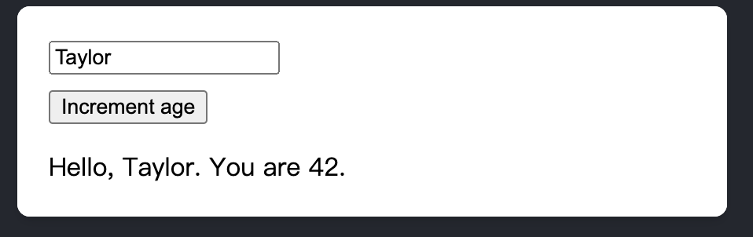

# [ react ]  useReducer 的使用 
## useReducer 的使用情境
`useReducer` 適合較複雜的 state，<font color="#FFBB00">因為我們可以將狀態的改變統一放在 reducer 去做管理 </font>，像 useState 的狀態改變就會分散在不同的函式裡面。

當你需要複雜的 state 邏輯而且包括多個子數值或下一個 state 依賴之前的 state，useReducer 會比 useState 更適用。而且 `useReducer` 可以讓你觸發深層更新的 component 作效能的最佳化，<font color="#FFBB00">因為你可以傳遞 dispatch 而不是 callback。</font>
## useReducer 語法
```jsx  showLineNumbers
const [state, dispatch] = useReducer(reducer, initialArg, init?)
```
* `reducer`: 用來設定變更 state 的規則以及如何更新，連接了 state 和 action 之間的關係。
（ The reducer function that specifies how the state gets updated. It must be pure, should take the state and action as arguments, and should <font color ="yellow">return the next state.</font> State and action can be of any types. ）

* `initialArg`: 設定了 state 初始狀態的值。
（ The value from which the initial state is calculated. It can be a value of any type. How the initial state is calculated from it depends on the next init argument.）

* `init`: The initializer function that should return the initial state. <font color ="yellow">If it’s not specified, the initial state is set to initialArg.</font> Otherwise, the initial state is set to the result of calling init(initialArg).

useReducer 主要回傳了兩個值 <font color="red">currentState </font>和<font color="red"> dispatch function </font>

* <font color="#99FF33">current state </font>:  During the first render, it’s set to init(initialArg) or initialArg (if there’s no init).

* <font color="#99FF33">dispatch function </font>: that lets you update the state to a different value and trigger a re-render.
## reducer function 

定義變更 state 的規則以及如何更新，連接了 state 和 action 之間的關係。

<font color="yellow">Actions can have any shape. By convention, it’s common to pass objects with a type property identifying the action. </font>It should include the minimal necessary information that the reducer needs to compute the next state.

```jsx  showLineNumbers
// 宣告如下
function reducer(state, action) {
  // ...
}
```
```jsx showLineNumbers
// 也可以加入 switch case 的寫法
function reducer(state, action) {
  switch (action.type) {
    case 'incremented_age': {
          // highlight-start
      return {
        name: state.name,
        age: state.age + 1
      };
      // highlight-end
    }

    case 'changed_name': {
        // highlight-start
      return {
        name: action.nextName,
        age: state.age
      };
      // highlight-end
    }
  }
  throw Error('Unknown action: ' + action.type);
}

```
```jsx showLineNumbers
function Form() {
  const [state, dispatch] = useReducer(reducer, { name: 'Taylor', age: 42 });
  
  function handleButtonClick() {
    // highlight-next-line
    dispatch({ type: 'incremented_age' });
  }

  function handleInputChange(e) {
    // highlight-start
    dispatch({
      type: 'changed_name',
      nextName: e.target.value
    });
    // highlight-end
  }
  // ...
```
## reducer function 要注意的點
:::danger 
State is read-only. Don’t modify any objects or arrays in state:
```jsx showLineNumbers
function reducer(state, action) {
  switch (action.type) {
    case 'incremented_age': {
      // 🚩 Don't mutate an object in state like this: 
     // highlight-next-line 
      state.age = state.age + 1;
      return state;
    }
```
Instead, always return new objects from your reducer:

```jsx showLineNumbers
function reducer(state, action) {
  switch (action.type) {
    case 'incremented_age': {
      // ✅ Instead, return a new object
      // highlight-start
      return {
        ...state,
        age: state.age + 1
      };
      // highlight-end
    }
```
:::
## Form 範例表單
1. 宣告 reducer function 
2. useReducer api and dispatch an Action 
3. show result and display

``` jsx showLineNumbers
// 建立 reducer function 
function reducer(state, action) {
  switch (action.type) {
    case 'incremented_age': {
      return {
        name: state.name,
        age: state.age + 1
      };
    }
    case 'changed_name': {
      return {
        name: action.nextName,
        age: state.age
      };
    }
  }
  throw Error('Unknown action: ' + action.type);
}
```
``` jsx showLineNumbers
import { useReducer } from 'react';

export default function Form() {
    // useReducer
    // highlight-next-line
  const [state, dispatch] = useReducer(reducer, initialState);

  function handleButtonClick() {
    // dispatch Action
    // highlight-next-line
    dispatch({ type: 'incremented_age' });
  }

  function handleInputChange(e) {
    // dispatch Action
    // highlight-start
    dispatch({
      type: 'changed_name',
      nextName: e.target.value
    }); 
    // highlight-end
  }
```
``` js showLineNumbers
// display
return (
    <>
      <input
        value={state.name}
        onChange={handleInputChange}
      />
      <button onClick={handleButtonClick}>
        Increment age
      </button>
      <p>Hello, {state.name}. You are {state.age}.</p>
    </>
  );
}
```

## 資料來源：
* https://react.dev/reference/react/useReducer#usage
* https://ithelp.ithome.com.tw/articles/10268258