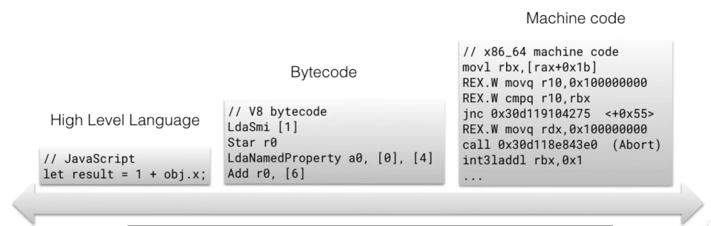

# 瀏覽器的翻譯官 Engine
## Who is Engine?
如果今天我想要在網頁呈現一顆咬了一口的蘋果，最直接的想法就是和電腦說：「嘿，在這邊顯示一顆咬了一口的蘋果給我」，可是畫面並不會顯示任何的蘋果，不論是完整個蘋果、咬了一口的蘋果或者是爛掉的蘋果，這是為什麼？

是因為電腦聽不懂你說了什麼，所以無法呈現你要的畫面，這時你候就需要一個可以翻譯你的語言給電腦聽的翻譯官，也就是 `Engine(引擎)`
## 常見的翻譯官有哪些？
常見的有V8(Chrome)、spiderMonkey(Firefox)、Chakra(Microsoft Edge)以及Carakan(Opera)。

就像我去日本，我需要專門的日文翻譯，所以不同的瀏覽器也會有不同的翻譯官負責，每一位翻譯官的能力與優缺點也完全不同。
## 翻譯官的工作內容有哪些？

首先JS文檔會先經過Parser(語意分析器)進行語法分析，，並且建立由文檔組成的資料結構(語意分析樹，也叫AST)，接著把剛剛建立的資料結構(AST)經由<font color="red">**直譯器(Interpreter)**</font>翻譯成ByteCode或是經由Profiler進行程式碼的監控與效能優化再經過<font color="red">**編譯器(Compiler)**</font>翻譯成電腦看得懂的語言。
## 直譯器(Interpreter)與編譯器(Compiler)的差別
在電腦世界裡，主要都是透過0101來溝通的，這邊稱為電腦語言;而我們常常寫的程式碼主要叫做程式語言，主要是方便人類看的，至於要將程式語言轉換成電腦語言就需要經過直譯器或是編譯器的轉換。

如程式碼所示：
直譯器在翻譯過程中會逐行去翻譯你所寫的程式碼，並且逐行去執行，所以直譯器會先執行宣告returnAdd，接著再執行for迴圈，每執行一次迴圈就會在宣告一次returnAdd並且執行。

直譯器的缺點就是重複的程式碼也是會逐行去翻譯與執行，因此造成程式碼的執行時間過長。

相反的，編譯器則是會一次性的翻譯你所寫的程式語言，翻譯完成後再一起執行，因此編譯器的執行時間會比－直譯器來的，缺點則是比較不好除錯。

```js  showLineNumbers
const returnAdd(a,b)=>{
    return a+b;
}

for(let i=0;i<500;i++){
 returnAdd(i,1000);
 console.log(i)。
}
```
因此在2008年的時候Google使用了V8引擎，結合了直譯器與編譯器的優點進行效能的最佳優化，而這就是所謂的JIT Compiler。

